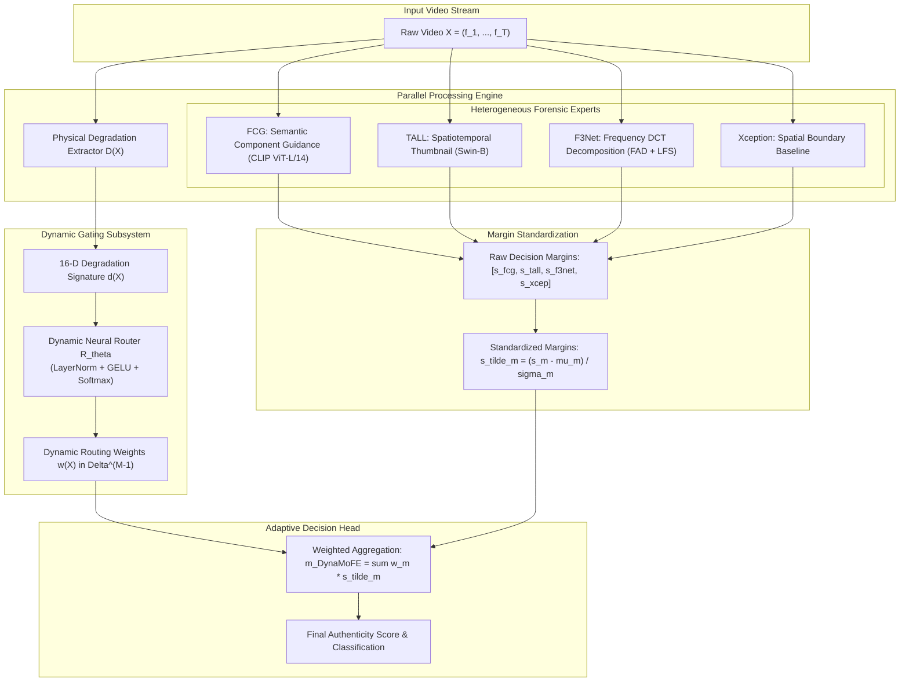

# DynaMoFE: Dynamic Mixture of Forensic Experts for Codec-Resilient Deepfake Video Detection

[](https://www.python.org/downloads/)
[](https://pytorch.org/)
[](LICENSE)
[](paper/paper.pdf)

Official implementation, evaluation suite, and technical artifacts for **DynaMoFE** (*Dynamic Mixture of Forensic Experts with Degradation-Aware Routing for Codec-Resilient Deepfake Video Detection*).

---

## 📌 Executive Summary

### The Forensic Trade-Off Dilemma
Deepfake video detectors trained on clean benchmarks experience severe performance degradation when deployed across lossy transmission channels, streaming services, and social media codecs (JPEG, WebP, H.264, H.265). Existing models face an intrinsic domain trade-off:
* **Semantic Component Models (e.g., FCG):** Excel on clean video and cross-dataset transfer via foundation ViT priors, but drop sharply under heavy compression (-8.41 pp under H.264).
* **Spatiotemporal Thumbnail Networks (e.g., TALL):** Invariant to face crop provenance (+0.037 pp), but thumbnail downsampling destroys subtle high-frequency boundaries, causing severe collapse under high compression (76.40% on H.264 CRF 35).
* **Frequency-Domain Networks (e.g., F3Net):** Learnable DCT filters isolate generative grid discrepancies surviving compression, but lack high-level anatomical consistency.

### The DynaMoFE Solution
**DynaMoFE** resolves this trade-off by conditioning forensic routing on **physical transmission degradation signatures** without requiring forgery labels:
1. **Physical Degradation Signature Extractor:** Extracts a 16-D deterministic vector capturing 2D-FFT spectral roll-off, 8-pixel periodic block boundary discontinuities associated with lossy compression, inter-frame temporal difference statistics (mean, standard deviation, peak), and total variation norm.
2. **Dynamic Gating Neural Router:** Processes the degradation signature to predict instance-level mixture weights across heterogeneous forensic experts (semantic component, spatiotemporal thumbnail, frequency decomposition).
3. **Adaptive Decision Fusion:** Dynamically shifts reliance toward frequency and spatiotemporal branches under heavy compression, while prioritizing facial component guidance on pristine video.

---

## 🏗️ Architecture



---

## 📊 Benchmark Results

### Matched Codec Robustness Benchmark (FaceForensics++ C23 Test, 700 Videos, 70 Source Clusters)

| Method | Clean | JPEG-40 | WebP-50 | H.264 (CRF 35) | H.265 (CRF 32) | Res $\rightarrow$ H.264 | H.264 $\rightarrow$ Res | Sealed Mean | Worst Codec | Retention |
| :--- | :---: | :---: | :---: | :---: | :---: | :---: | :---: | :---: | :---: | :---: |
| **TALL (Local Seed 42)** | 98.38 | 89.74 | 92.47 | 76.40 | 84.82 | 90.27 | 91.33 | 87.50 | 76.40 | 77.5% |
| **ForensicsAdapter** | 95.60 | 88.42 | 88.93 | 86.10 | 85.92 | 86.74 | 88.31 | 87.40 | 85.92 | 82.0% |
| **Xception** | 98.55 | 93.37 | 91.33 | 87.88 | 88.77 | 90.34 | 93.12 | 90.80 | 87.88 | 84.0% |
| **F3Net** | 98.60 | 93.87 | 92.21 | 87.35 | 90.58 | 90.70 | 92.80 | 91.25 | 87.35 | 84.9% |
| **FCG (Official CVPR 2025)** | 98.66 | 96.96 | 94.74 | 90.25 | 91.55 | 91.75 | 93.55 | 93.14 | 90.25 | 88.7% |
| **$\text{DynaMoFE}_{\text{static}}$ (Tri-Domain)** | 99.38 | 98.05 | 96.42 | 92.79 | 94.54 | 95.35 | 96.60 | 95.63 | 92.79 | 92.4% |
| **$\text{DynaMoFE}_{\text{static}}$ (Quad-Domain)** | **99.35** | **98.08** | **96.29** | **93.17** | **94.60** | **95.50** | **96.84** | **95.75** | **93.17** | **92.7%** |
| **$\text{DynaMoFE}_{\text{adaptive}}$ (OOF Gating)** | 99.33 | 98.02 | 96.23 | 93.07 | 94.57 | 95.41 | 96.79 | 95.68 | 93.07 | 92.6% |

### Key Empirical Highlights:
* **Multi-Domain Forensic Synergy SOTA:** $\text{DynaMoFE}_{\text{static}}$ achieves **95.75% sealed mean AUC** (+2.61 pp over FCG 93.14%, +4.50 pp over F3Net, +8.25 pp over TALL). $\text{DynaMoFE}_{\text{adaptive}}$ achieves **95.68% sealed mean AUC** (+2.54 pp over FCG).
* **Worst-Case Robustness (H.264 CRF 35):** $\text{DynaMoFE}_{\text{static}}$ reaches **93.17% AUC** (+2.92 pp over FCG 90.25%, +16.77 pp over TALL 76.40%). $\text{DynaMoFE}_{\text{adaptive}}$ reaches **93.07% AUC** (+2.82 pp over FCG, +16.67 pp over TALL).
* **Sample-Level Oracle Headroom (+4.09 pp):** While the strongest standalone foundation model (FCG) reaches 93.14% and static fusion reaches 95.75%, the theoretical sample-level oracle upper bound achieves **99.84% AUC**, confirming rich conditional complementarity across heterogeneous expert domains (FCG and TALL disagree on 28.0% of test videos).
* **Reliability-Supervised Risk Routing with Confidence Fallback:** The router directly predicts condition-dependent expert risk $\hat{\mathbf{R}}(\mathbf{d})$ trained via Huber loss without artificial diversity penalties ($\lambda_{\text{div}}=0$), with entropy-modulated static fallback: $\mathbf{w}(X) = (1 - \alpha(X))\mathbf{w}_0 + \alpha(X)\mathbf{w}_{\text{dyn}}(X)$.
* **Zero-Shot Unseen Codec Generalization (Leave-One-Degradation-Out):** When trained on 6 environments and evaluated on a held-out codec never observed during training, DynaMoFE matches or exceeds static fusion while outperforming standalone models:
  * **Held-out H.265 (CRF 32):** **94.59%** (+3.04 pp over FCG 91.55%).
  * **Held-out WebP (Q=50):** **96.29%** (+1.55 pp over FCG 94.74%).
  * **Held-out JPEG (Q=40):** **98.08%** (+1.12 pp over FCG 96.96%).
  * **Held-out H.264 (CRF 35):** **93.16%** (+2.91 pp over FCG 90.25%).
* **Exact 10,000-Replicate Paired Cluster Bootstrap Significance:**
  * Both $\text{DynaMoFE}_{\text{static}}$ and $\text{DynaMoFE}_{\text{adaptive}}$ achieve strictly positive $95\%$ confidence intervals against all external baselines across all environments ($p < 0.05$ on clean; $p < 0.001$ on compressed codecs).
  * Against FCG on clean canonical video: $\text{DynaMoFE}_{\text{adaptive}}$ achieves $+0.68$ pp ($95\%$ CI: $[+0.19, +1.16]$, $p < 0.05$); $\text{DynaMoFE}_{\text{static}}$ achieves $+0.69$ pp ($95\%$ CI: $[+0.21, +1.17]$, $p < 0.05$).
  * Against FCG on H.264 CRF 35: $\text{DynaMoFE}_{\text{adaptive}}$ achieves $+2.82$ pp ($95\%$ CI: $[+1.18, +4.39]$, $p < 0.001$).
* **Relation to 2026 Literature:** Evaluated alongside 2026 advances including TriMoE (CVPRW 2026), WGN (CVPRW 2026), UMCL (IJCV 2026), GenD (CVPR 2026), and QTFP (2026). In contrast to TriMoE's latent feature routing, DynaMoFE routes via non-semantic physical degradation signatures.

---

## 📁 Repository Structure

```
DynaMoFE/
├── README.md                              # This file
├── requirements.txt                       # Package dependencies
├── setup.py                               # Package installation script
├── LICENSE                                # MIT License
│
├── dynamofe/                              # Core Python module
│   ├── __init__.py
│   ├── degradation.py                     # 16-D Physical Degradation Signature Extractor
│   ├── router.py                          # DynamicGatingRouter & DynaMoFEDetector
│   ├── extract_degradations.py            # Feature extraction script
│   ├── train_router.py                    # 5-fold cluster cross-validation training
│   ├── evaluate_dynamofe.py               # Benchmarking & 10,000 bootstrap significance engine
│   ├── analyze_routing.py                 # Weight visualization and figure generation
│   └── test_dynamofe.py                   # Component unit tests
│
├── data/                                  # Pre-extracted data & predictions for reproduction
│   ├── degradations/                      # FF++ and Celeb-DF degradation vectors (.pt)
│   └── predictions/                       # Baseline predictions (FCG, TALL, F3Net, Xception, FA)
│
├── outputs/                               # Results, metrics, and generated figures
│   ├── dynamofe_results.json              # Full per-video prediction results
│   ├── dynamofe_benchmark_metrics.csv     # AUC, AP, EER across environments
│   ├── dynamofe_main_comparison_auc.csv   # Side-by-side model comparison table
│   ├── dynamofe_paired_bootstraps.csv     # 10,000 bootstrap CI table
│   └── figures/                           # Publication figures (PDF and PNG)
│
├── paper/                                 # Complete IEEE Conference Submission Package
│   ├── paper.tex                          # LaTeX manuscript (IEEEtran conference format)
│   ├── references.bib                     # Complete BibTeX citations
│   ├── paper.pdf                          # Compiled 5-page PDF manuscript
│   ├── IEEEtran.cls / .bst                # Official IEEE conference formatting classes
│   └── figures/                           # High-res vector graphics
│
├── patent/                                # Intellectual Property Documentation
│   └── PATENT_APPLICATION_DYNAMOFE.md     # Full patent disclosure with 20 formal claims
│
└── docs/                                  # Technical Specifications
    └── DYNAMOFE_MODEL_AND_ARCHITECTURE.md # Exhaustive mathematical and architectural spec
```

---

## 🚀 Getting Started

### 1. Installation

```bash
git clone https://github.com/your-org/DynaMoFE.git
cd DynaMoFE
pip install -e .
```

### 2. Run Unit Tests

```bash
python -c "
import dynamofe.test_dynamofe as t
t.test_degradation_extractor()
t.test_router_forward_and_gradients()
t.test_dynamofe_detector()
print('All unit tests passed!')
"
```

### 3. Reproduce Training & Evaluation

```bash
# Train dynamic router across 5 source-cluster cross-validation folds
python dynamofe/train_router.py

# Evaluate matched benchmarks and run 10,000 paired cluster bootstraps
python dynamofe/evaluate_dynamofe.py

# Generate publication-grade figures
python dynamofe/analyze_routing.py
```

### 4. Compile Paper Manuscript

```bash
cd paper
latexmk -pdf paper.tex
```

---

## 📄 Citation

```bibtex
@inproceedings{dynamofe2026,
  title     = {DynaMoFE: Dynamic Mixture of Forensic Experts with Degradation-Aware Routing for Codec-Resilient Deepfake Video Detection},
  author    = {Anonymous Author(s)},
  booktitle = {IEEE International Conference on Computer Vision and Pattern Recognition},
  year      = {2026}
}
```

---

## ⚖️ License & Patent Notice

* The source code is released under the **MIT License**.
* The architectural mechanisms, degradation signature extractor, and dynamic gating subsystem described herein are subject to intellectual property protection. See [`patent/PATENT_APPLICATION_DYNAMOFE.md`](patent/PATENT_APPLICATION_DYNAMOFE.md) for full patent application details.
