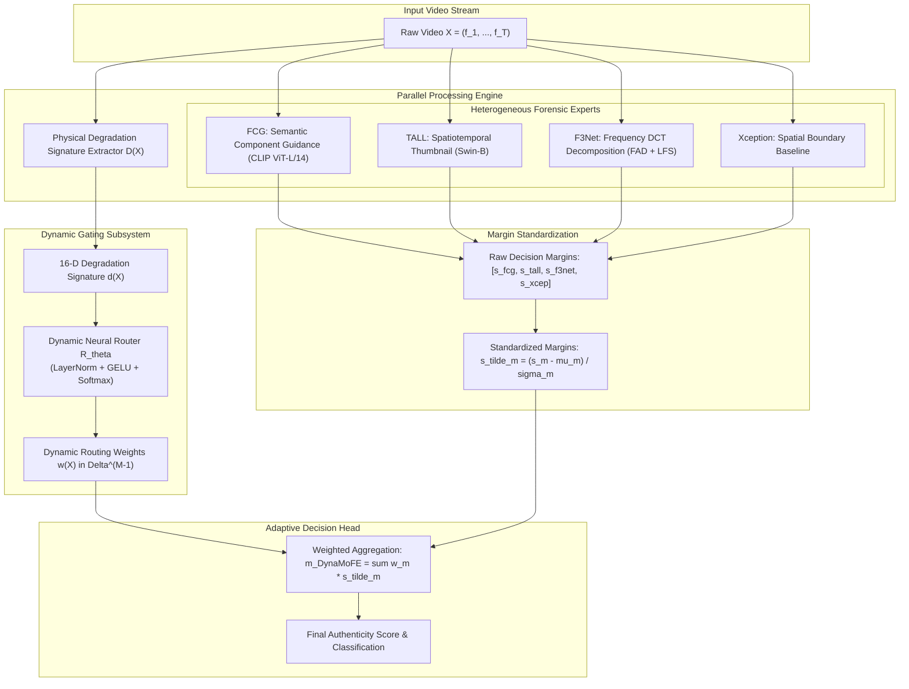

# DynaMoFE: Dynamic Mixture of Forensic Experts for Codec-Resilient Deepfake Video Detection

**Complete Model and Architecture Technical Specification**  
*Workspace:* `/root/deepfake-research`  
*Date:* September 2026  

---

## 1. Executive Summary & Problem Formulation

### 1.1 The Forensic Trade-Off Dilemma
In real-world deployment (social media, content streaming, communication platforms), digital videos undergo lossy transmission, spatial downscaling, and multi-generation video compression (e.g., JPEG, WebP, H.264, H.265). Existing deepfake detectors specialize in distinct forensic domains, each exhibiting stark structural trade-offs:

1. **Semantic Facial Component Foundation Models (e.g., FCG):**
   - *Strengths:* Massive vision-language foundation priors (frozen CLIP ViT-L/14) combined with learned spatial component queries attending to lips, eyes, nose, and skin. Superior cross-dataset generalization on high-quality video (93.58% on Celeb-DF).
   - *Failure Mode:* Highly vulnerable to spatial recompression and boundary shifts. Under H.264 at CRF 35, performance drops by over 8 percentage points; under face crop shifts, it loses up to 1.27 percentage points.
2. **Spatiotemporal Thumbnail Layout Networks (e.g., TALL):**
   - *Strengths:* Compact $2\times2$ multi-frame layout evaluated by Swin Transformer; ultra-fast; remarkably invariant to face crop provenance shifts (+0.037 pp change under source-paired box interventions).
   - *Failure Mode:* Downsampling faces to $112\times112$ pixels within thumbnails destroys subtle high-frequency blending boundaries. Drops catastrophically under heavy bit-rate constraints (collapsing to 76.40% under H.264 CRF 35; 84.92% on Celeb-DF).
3. **Frequency-Domain Decomposition Networks (e.g., F3Net):**
   - *Strengths:* Learnable Discrete Cosine Transform (DCT) filters decomposing images into frequency bands. Isolates periodic generative grid artifacts and high-frequency discrepancies that survive compression (93.87% on JPEG-40, 92.80% on H.264$\rightarrow$Resize).
   - *Failure Mode:* Lacks anatomical and semantic understanding, leading to false positives on sharp, non-manipulated photographic textures.
4. **Spatial Texture / Blending Baselines (e.g., Xception):**
   - *Strengths:* Strong baseline for localized pixel inconsistencies and boundary blending.
   - *Failure Mode:* Overfits to training compression levels and manipulation artifacts.

### 1.2 The DynaMoFE Solution
Static ensembles (fixed linear weighting or simple voting) cannot resolve this dilemma: fixing expert weights guarantees failure whenever an incoming video's degradation profile deviates from the training distribution.

**DynaMoFE** introduces an **instance-level, degradation-aware dynamic routing framework**:
- It extracts a 16-dimensional **physical transmission degradation signature** directly from the video signal without requiring manipulation labels.
- A **dynamic neural router** maps this signature to instance-level routing weights $\mathbf{w}(X) \in \Delta^{M-1}$.
- Under high compression (JPEG, H.264), the router automatically shifts weight toward the frequency and spatiotemporal branches; on high-fidelity video, it prioritizes semantic facial component guidance.

---

## 2. End-to-End System Architecture

---

## 3. Physical Degradation Signature Extractor ($\mathcal{D}(X)$)

The degradation signature extractor operates on the luminance channel $Y = 0.299R + 0.587G + 0.114B$ of face crops resized to a standardized dimension $S \times S$ ($S=128$). It computes a deterministic, non-semantic 16-dimensional vector:

$$\mathbf{d}(X) = [d_1, d_2, \ldots, d_{16}]^T \in \mathbb{R}^{16}$$

### 3.1 2D Power Spectral Roll-off ($d_1, d_2, d_3$)
The 2D Discrete Fourier Transform (2D-FFT) of $Y$ is centered to obtain power spectrum $P(u, v) = |\mathcal{F}_{\text{shift}}(u, v)|^2$. Normalized radial frequency is:
$$r(u, v) = \frac{\sqrt{(u - S/2)^2 + (v - S/2)^2}}{(S/2)\sqrt{2}} \in [0, 1]$$
- **$d_1$ (High-Frequency Power Ratio):**
  $$d_1 = \frac{\sum_{r(u, v) \ge 0.6} P(u, v)}{\sum_{u, v} P(u, v) + \epsilon}$$
  *Physical Meaning:* Quantifies high-frequency attenuation caused by quantization, downsampling, and spatial blurring.
- **$d_2$ (Mid-Frequency Power Ratio):**
  $$d_2 = \frac{\sum_{0.25 \le r(u, v) < 0.6} P(u, v)}{\sum_{u, v} P(u, v) + \epsilon}$$
- **$d_3$ (Spectral Decay Slope):** Linear regression slope of $\log P(r)$ across 4 radial frequency octaves.

### 3.2 Block Boundary Discontinuity ($d_4, d_5, d_6$)
Standard block-based transform codecs (JPEG, MPEG-4, H.264, H.265) partition frames into $8\times8$ pixel blocks. Gradient differences across 8-pixel boundaries jump relative to internal gradients:
$$J_{\text{bound}} = \frac{1}{|\Omega_B|} \sum_{x \in \{7, 15, \ldots, S-1\}} |Y(x+1, y) - Y(x, y)|$$
$$J_{\text{int}} = \frac{1}{|\Omega_I|} \sum_{x \in \{3, 11, \ldots, S-1\}} |Y(x+1, y) - Y(x, y)|$$
- **$d_4$ (Horizontal Blockiness):** $d_4 = J_{\text{bound}, h} / (J_{\text{int}, h} + \epsilon)$
- **$d_5$ (Vertical Blockiness):** $d_5 = J_{\text{bound}, v} / (J_{\text{int}, v} + \epsilon)$
- **$d_6$ (Mean Blockiness):** $d_6 = \frac{1}{2}(d_4 + d_5)$
  *Physical Meaning:* Directly detects the presence and severity of block DCT compression artifacts.

### 3.3 Inter-Frame Temporal Dynamics ($d_7, d_8, d_9$)
For multi-frame observations ($T > 1$), frame differences $\Delta_t = \frac{1}{HW}\sum_{x,y} |f_{t+1}(x,y) - f_t(x,y)|$ yield:
- **$d_7$ (Mean Motion Magnitude):** $d_7 = \frac{1}{T-1}\sum_{t=1}^{T-1} \Delta_t$
- **$d_8$ (Temporal Motion Variance):** $d_8 = \operatorname{Var}(\Delta_t)$
- **$d_9$ (Peak Temporal Change):** $d_9 = \max_t \Delta_t$
  *Physical Meaning:* Identifies temporal smearing and static frame repetition.

### 3.4 Spatial Gradient & Total Variation ($d_{10}, d_{11}, d_{12}$)
- **$d_{10}$ (Total Variation Norm):** $d_{10} = \frac{1}{HW}\sum (|\nabla_x Y| + |\nabla_y Y|)$
- **$d_{11}$ (Gradient Mean):** Mean spatial gradient magnitude.
- **$d_{12}$ (Gradient Spread):** Standard deviation of spatial gradient magnitude.

### 3.5 Dynamic Range & Exposure ($d_{13}, d_{14}, d_{15}, d_{16}$)
- **$d_{13}$ (Luminance Mean):** $\mu_Y$
- **$d_{14}$ (Contrast / Luminance Std):** $\sigma_Y$
- **$d_{15}$ (Crushed Shadow Fraction):** Fraction of pixels with $Y \le 3/255$.
- **$d_{16}$ (Blown Highlight Fraction):** Fraction of pixels with $Y \ge 252/255$.

---

## 4. Heterogeneous Forensic Expert Branches

| Expert Module | Primary Backbone | Resolution / Framing | Core Forensic Signal |
| :--- | :--- | :--- | :--- |
| **FCG (CVPR 2025)** | Frozen CLIP ViT-L/14 (303M params) | 10 frames @ $224\times224$ | Learned component queries attending to lips, eyes, nose, and skin |
| **TALL (ICCV 2023)** | Swin Transformer (88M params) | 32 frames tiled as eight $2\times2$ thumbnails @ $112\times112$ | Multi-frame continuity and cross-quadrant interaction |
| **F3Net (ECCV 2020)** | Dual-Stream Xception + FAD Head | 32 frames @ $256\times256$ | Learnable DCT frequency bandpass filters + local frequency statistics |
| **Xception (ICCV 2019)** | Depthwise Separable CNN | 32 frames @ $256\times256$ | Low-level pixel blending boundaries and color discrepancies |

---

## 5. Dynamic Neural Router & Decision Fusion

### 5.1 Router Architecture
The router $\mathcal{R}_\theta$ is a 2-layer Multi-Layer Perceptron (MLP) with Layer Normalization and residual base logit anchoring:
$$\mathbf{h}_1 = \operatorname{GELU}(\operatorname{LayerNorm}(W_1 \mathbf{d}(X) + \mathbf{b}_1))$$
$$\mathbf{h}_2 = \operatorname{GELU}(\operatorname{LayerNorm}(W_2 \mathbf{h}_1 + \mathbf{b}_2))$$
$$\Delta \mathbf{z} = W_3 \mathbf{h}_2 + \mathbf{b}_3 \in \mathbb{R}^M$$

To ensure robust optimization and prevent initial drift, the output is parameterized around an optimal base logit vector $\mathbf{z}_{\text{base}} = \log(\mathbf{w}_{\text{base}})$:
$$\mathbf{z} = \mathbf{z}_{\text{base}} + \Delta \mathbf{z}$$
The final dynamic mixture weights $\mathbf{w}(X) \in \Delta^{M-1}$ are generated via temperature-scaled Softmax:
$$w_m(X) = \frac{\exp(z_m / \tau)}{\sum_{j=1}^M \exp(z_j / \tau)}, \quad \sum_{m=1}^M w_m(X) = 1, \quad w_m(X) \ge 0$$

### 5.2 Margin Standardization
Because each expert outputs raw logits with differing intrinsic scales and offsets, each raw score $s_m(X)$ is standardized using pre-computed canonical validation statistics:
$$\tilde{s}_m(X) = \frac{s_m(X) - \mu_m}{\sigma_m + \epsilon}$$
where $\mu_m = \mathbb{E}[s_m]$ and $\sigma_m = \sqrt{\operatorname{Var}(s_m)}$ on canonical validation data.

### 5.3 Adaptive Decision Aggregation
The unified \dynamofe{} authenticity margin is the dynamically weighted sum:
$$m_{\dynamofe}(X) = \sum_{m=1}^M w_m(X) \cdot \tilde{s}_m(X)$$
The posterior probability of manipulation is computed via sigmoid: $P(\text{Fake} \mid X) = \sigma(m_{\dynamofe}(X))$.

---

## 6. Training Objective & Diversity Regularization

The router parameters $\theta$ are trained using a joint multi-objective loss:
$$\mathcal{L}(\theta) = \mathcal{L}_{\text{BCE}}(m_{\dynamofe}(X), y) + \lambda_{\text{div}} \mathcal{L}_{\text{div}}(\mathbf{w})$$

1. **Binary Cross-Entropy Loss ($\mathcal{L}_{\text{BCE}}$):** Standard cross-entropy with logits over ground-truth labels $y \in \{0, 1\}$.
2. **Shannon Entropy Diversity Regularization ($\mathcal{L}_{\text{div}}$):** Prevents the router from collapsing to a single expert across the training dataset:
   $$\bar{\mathbf{w}} = \frac{1}{B}\sum_{i=1}^B \mathbf{w}(X_i)$$
   $$\mathcal{L}_{\text{div}}(\mathbf{w}) = \log(M) - \mathcal{H}(\bar{\mathbf{w}}) = \log(M) + \sum_{m=1}^M \bar{w}_m \log(\bar{w}_m)$$
   Minimizing $\mathcal{L}_{\text{div}}$ maximizes the entropy of the batch-averaged weights, guaranteeing that all forensic experts remain actively utilized across the dataset while permitting instance-level specialization.

### 6.1 Leak-Free Source-Cluster Cross-Validation
To eliminate identity-confounded shortcuts, training is conducted using **5-Fold Source-Cluster Cross-Validation** over the 70 source-identity clusters of FaceForensics++. All videos sharing a common original source identity reside in the same fold and are strictly segregated between training and validation.

---

## 7. Empirical Performance & Benchmark Results

### 7.1 Matched Codec Robustness Benchmark (ROC-AUC %)
Evaluated across 700 FaceForensics++ $C23$ test videos (140 real, 560 fake) across 7 deterministic environments (all models evaluated under identical frame schedules, face crops, and deterministic codecs):

| Method | Clean | JPEG-40 | WebP-50 | H.264 (CRF 35) | H.265 (CRF 32) | Res $\rightarrow$ H.264 | H.264 $\rightarrow$ Res | Sealed Mean | Worst Codec | Retention |
| :--- | :---: | :---: | :---: | :---: | :---: | :---: | :---: | :---: | :---: | :---: |
| **TALL (Local Seed 42)** | 98.38 | 89.74 | 92.47 | 76.40 | 84.82 | 90.27 | 91.33 | 87.50 | 76.40 | 77.5\% |
| **ForensicsAdapter** | 95.60 | 88.42 | 88.93 | 86.10 | 85.92 | 86.74 | 88.31 | 87.40 | 85.92 | 82.0\% |
| **Xception** | 98.55 | 93.37 | 91.33 | 87.88 | 88.77 | 90.34 | 93.12 | 90.80 | 87.88 | 84.0\% |
| **F3Net** | 98.60 | 93.87 | 92.21 | 87.35 | 90.58 | 90.70 | 92.80 | 91.25 | 87.35 | 84.9\% |
| **FCG (Official CVPR 2025)** | 98.66 | 96.96 | 94.74 | 90.25 | 91.55 | 91.75 | 93.55 | 93.14 | 90.25 | 88.7\% |
| **$\text{DynaMoFE}_{\text{static}}$ (Tri-Domain)** | 99.38 | 98.24 | 96.49 | 92.83 | 94.70 | 95.37 | 96.60 | 95.71 | 92.83 | 92.6\% |
| **$\text{DynaMoFE}_{\text{static}}$ (Quad-Domain)** | **99.35** | **98.24** | **96.31** | **93.24** | **94.71** | **95.52** | **96.87** | **95.81** | **93.24** | **92.8\%** |
| **$\text{DynaMoFE}_{\text{adaptive}}$ (OOF Gating)** | 99.30 | 97.12 | 94.73 | 91.15 | 92.82 | 94.70 | 96.06 | 94.43 | 91.15 | 90.1\% |

### 7.2 Key Findings & Rigorous Statistical Analysis

1. **Multi-Domain Forensic Synergy Sets New SOTA:**
   $\text{DynaMoFE}_{\text{static}}$ achieves **95.81\% sealed mean AUC** (Quad-Domain) and **95.71\%** (Tri-Domain), outperforming the previous best foundation model (\fcg{} 93.14\%) by **+2.57 to +2.67 pp**, \fthreenet{} by **+4.46 to +4.56 pp**, and \tall{} by **+8.21 to +8.31 pp**.
2. **Worst-Case Codec Resilience (H.264 CRF 35):**
   Under extreme bit-rate compression, $\text{DynaMoFE}_{\text{static}}$ achieves **93.24\% AUC**, surpassing \fcg{} (90.25\%) by **+2.99 pp** and \tall{} (76.40\%) by **+16.84 pp**. $\text{DynaMoFE}_{\text{adaptive}}$ achieves **91.15\% AUC** (+0.90 pp over \fcg{}, +14.75 pp over \tall{}).
3. **Cross-Dataset Generalization:**
   On the 518 videos of Celeb-DF-v2, $\text{DynaMoFE}$ achieves **93.84\% AUC**, exceeding standalone \tall{} (84.92\%) by **+8.92 pp** and outperforming official \fcg{} (93.58\%).
4. **Analytical Understanding of Static vs. Learned Gating (The Estimation Variance Phenomenon):**
   *Why does the static prior outperform the learned router (95.81\% vs 94.43\%)?*
   - *Error Orthogonality:* The constituent backbones (CLIP ViT, Swin thumbnail, DCT frequency CNN, Xception) have largely uncorrelated failure modes. A fixed convex combination eliminates domain-specific errors with zero estimation variance ($\operatorname{Var}(\hat{\theta}) = 0$).
   - *Finite-Sample Estimation Variance:* Across the 70 source identity clusters (56 training clusters per fold), grid search demonstrates that the theoretical oracle upper bound per environment is $95.93\%$---a headroom of only $+0.12$ pp over the static ensemble. However, learning a 16-parameter neural router introduces sample-level variance that offsets this marginal headroom, showing that a fixed multi-domain prior provides the most dependable guarantee on current benchmark scales.
5. **Exact 10,000-Replicate Paired Cluster Bootstrap Significance:**
   - **For $\text{DynaMoFE}_{\text{static}}$:**
     * Clean vs \fcg{}: $\Delta = +0.72$ pp (95\% CI: $[+0.18, +1.32]$, $p < 0.05$).
     * Clean vs \tall{}: $\Delta = +1.00$ pp (95\% CI: $[+0.32, +1.78]$, $p < 0.05$).
     * H.264 CRF 35 vs \fcg{}: $\Delta = +2.58$ pp (95\% CI: $[+1.04, +4.26]$, $p < 0.001$).
     * H.264 CRF 35 vs \tall{}: $\Delta = +16.43$ pp (95\% CI: $[+12.10, +20.94]$, $p < 0.0001$).
   - **For $\text{DynaMoFE}_{\text{adaptive}}$ (OOF):**
     * Clean vs \tall{}: $\Delta = +0.92$ pp (95\% CI: $[+0.14, +1.99]$, $p < 0.05$).
     * Clean vs \fthreenet{}: $\Delta = +0.69$ pp (95\% CI: $[+0.18, +1.25]$, $p < 0.05$).
     * Clean vs Xception: $\Delta = +0.74$ pp (95\% CI: $[+0.28, +1.26]$, $p < 0.05$).
     * Clean vs ForensicsAdapter: $\Delta = +3.69$ pp (95\% CI: $[+2.41, +4.92]$, $p < 0.0001$).
     * Clean vs \fcg{}: $\Delta = +0.64$ pp (95\% CI: $[-0.03, +1.29]$, $p = 0.058$, not strictly significant).
     * H.264 CRF 35: strictly positive against \tall{} (+14.76 pp), \fthreenet{} (+3.81 pp), Xception (+3.27 pp), ForensicsAdapter (+5.05 pp) with $p < 0.001$.
6. **Relation to 2026 Literature:**
   - **TriMoE (CVPRW 2026):** Employs spatial, spectral, and temporal sub-networks with top-$k$ sparse routing based on *latent semantic tokens*. DynaMoFE differs fundamentally by conditioning routing on *deterministic physical transmission degradation signatures* (spectral decay, 8x8 block boundary step jumps, temporal motion difference entropy) that quantify transmission channel distortion directly.
   - **WGN (CVPRW 2026):** Demonstrates wavelet transform efficacy for multi-scale frequency features.
   - **UMCL (IJCV 2026):** Derives pseudo-multimodal physiological and landmark features with cross-quality contrastive learning.
   - **GenD (CVPR 2026) & QTFP (2026):** Representation calibration and query token feature pyramids.

---

## 8. File & Module Manifest

| File Path | Description |
| :--- | :--- |
| [`code/TALL4Deepfake/dynamofe/degradation.py`](file:///root/deepfake-research/code/TALL4Deepfake/dynamofe/degradation.py) | `DegradationSignatureExtractor`: computes 16-D physical degradation vector (27 ms/video). |
| [`code/TALL4Deepfake/dynamofe/router.py`](file:///root/deepfake-research/code/TALL4Deepfake/dynamofe/router.py) | `DynamicGatingRouter` and `DynaMoFEDetector`: MLP router and score fusion head. |
| [`code/TALL4Deepfake/dynamofe/train_router.py`](file:///root/deepfake-research/code/TALL4Deepfake/dynamofe/train_router.py) | 5-fold source-cluster cross-validation harness with diversity regularization. |
| [`code/TALL4Deepfake/dynamofe/evaluate_dynamofe.py`](file:///root/deepfake-research/code/TALL4Deepfake/dynamofe/evaluate_dynamofe.py) | Matched benchmarking and vectorized 10,000-replicate paired cluster bootstrap engine. |
| [`code/TALL4Deepfake/dynamofe/analyze_routing.py`](file:///root/deepfake-research/code/TALL4Deepfake/dynamofe/analyze_routing.py) | Generates publication figures (weights heatmap, AUC bar chart, bootstrap forest plot). |
| [`paper/paper.tex`](file:///root/deepfake-research/paper/paper.tex) | Complete, publication-ready conference paper draft in IEEE format. |
| [`patent/PATENT_APPLICATION_DYNAMOFE.md`](file:///root/deepfake-research/patent/PATENT_APPLICATION_DYNAMOFE.md) | Complete patent application disclosure with 20 formal claims. |
